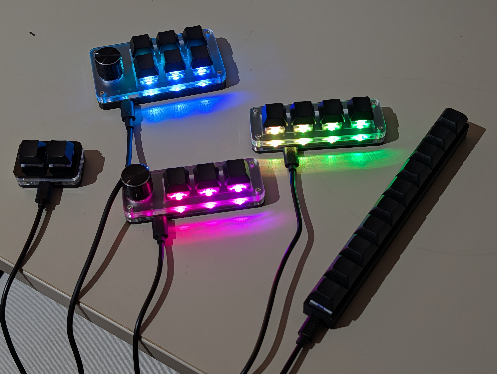

# KeypadFlasher

This project contains custom firmware compatible with a number of different CH55x based programmable keypads found on sites like AliExpress and Amazon.

## Usage

Don't have a keypad yet? See the [supported devices](#supported-devices) section for some compatible options.

If you're using a new device for the first time, please refer to the [bootloader](docs/bootloader.md) documentation for instructions on how to enter bootloader mode on your device.

Visit https://keypad-flasher.amyjeanes.com in a WebUSB compatible browser (anything based on Chromium, e.g. Chrome, Edge, Opera) once you have the device in bootloader mode and follow the instructions in the web app to configure and flash the new firmware to your keypad.

Please note that the original firmware on the device will be lost when you flash this custom firmware, so only proceed if you are okay with that.

If you wish to help develop the project, please see the [development](docs/development.md) documentation.

## Supported devices

The following is a list of supported devices. Other CH55x based keypads may also be compatible but will need to be added to this project first. See the [developer instructions](docs/development.md#adding-support-for-new-keypads) for how to add support for new devices.

They all have USB-C connectors unless otherwise noted:

- [2 Keys](https://www.aliexpress.com/item/1005004970126333.html?spm=a2g0o.order_detail.order_detail_item.3.3c7af19cNrdJJB)
  - Uses non-standard LEDs that are not compatible with this project's NeoPixel support so LED functionality will not work
- [3 Keys 1 Knob](https://www.aliexpress.com/item/1005006627901462.html?spm=a2g0o.order_detail.order_detail_item.3.295bf19c3IDC8m)
- [4 Keys](https://www.aliexpress.com/item/1005008020501723.html?spm=a2g0o.order_detail.order_detail_item.3.7d51f19cZTzoOY)
- [6 Keys 1 Knob](https://www.aliexpress.com/item/1005009812219099.html?spm=a2g0o.order_detail.order_detail_item.3.6afff19cXlayc4)
- [6 Keys 1 Knob (Sikai)](https://sikaicase.com/products/6key-usb-c-macro-programmable-keyboard-osu-one-handed-mechanical-keyboard-with-knobs-6-fully-programmable-keys-hotkeys-rgb-backlit-mini-keypad-for-pc-gamer-1)
- [10 Keys](https://www.aliexpress.com/item/1005005509140217.html?spm=a2g0o.order_detail.order_detail_item.7.3c7af19cNrdJJB)
  - Uses fixed blue LEDs that are always on and cannot be controlled by the firmware

## Unsupported devices

These devices have been tested and found to use different types of microcontrollers, and are not compatible with this firmware:

- [9 Keys](https://www.aliexpress.com/item/1005005307250747.html?spm=a2g0o.order_detail.order_detail_item.5.3c7af19cNrdJJB)
  - Uses a CH32V203 microcontroller
  - Can remap keys using https://sayodevice.com/ web-based flasher (similar to this project!)
- [12 Keys 2 Knobs](https://www.aliexpress.com/item/1005007160113318.html?spm=a2g0o.order_detail.order_detail_item.3.5bd6f19cdqcQwn)
  - Uses a CH579M microcontroller
  - Can remap keys using https://github.com/kriomant/ch57x-keyboard-tool or other CH57x programming tools
