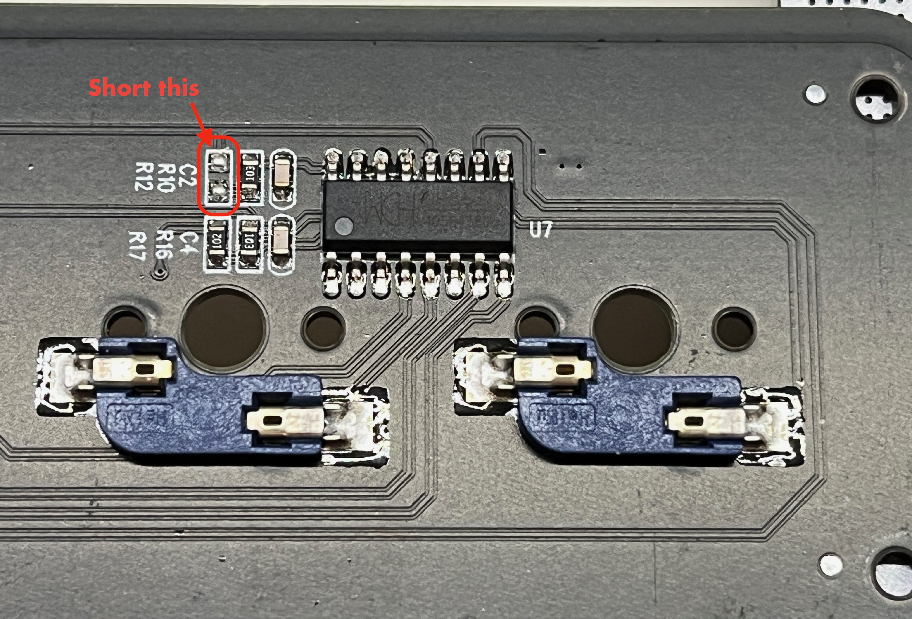
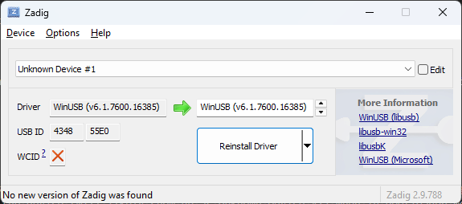
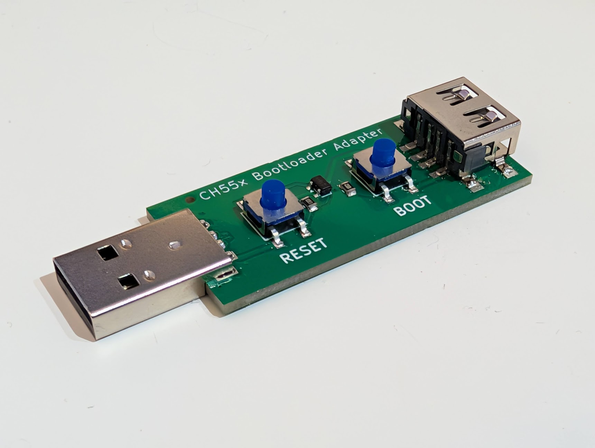
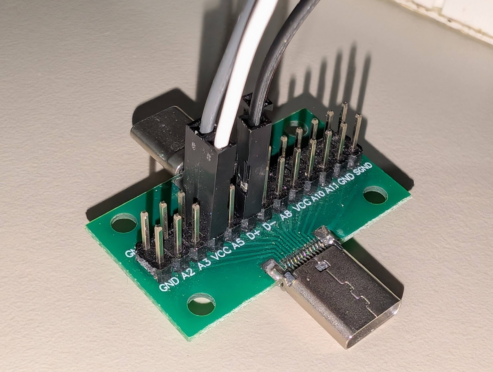
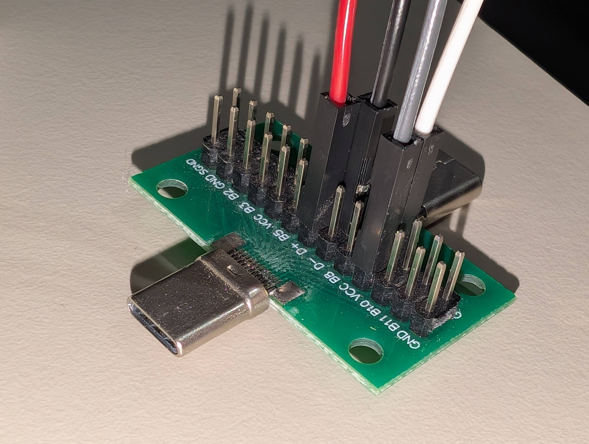
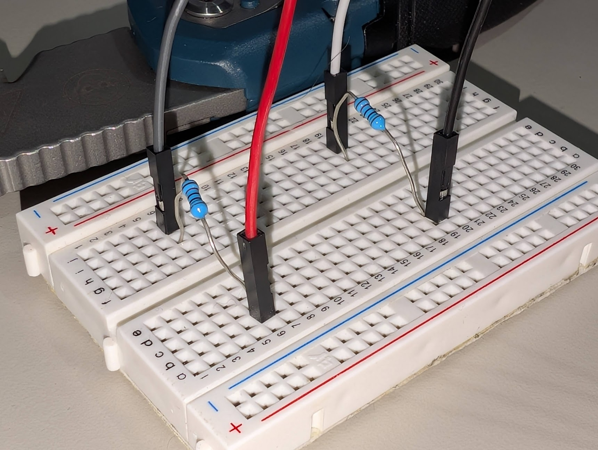

# Bootloader mode

The keypads supported by this project do not have an easy built-in way to enter bootloader mode, which is required to flash custom firmware onto them.

I have developed a simple adapter that you can plug into the device in between the USB cable and the keypad that will allow you to easily enter bootloader mode without opening the device up. You can purchase them from eBay here: https://www.ebay.com/itm/168130551869

For more information on the adapter and how it works, see the [Official adapter](#official-adapter) section below.

If you don't want to use eBay please contact me via email (see my GitHub profile) and we can work out some other way to get one to you.

You may be able to short certain pads on certain devices to enter bootloader mode as well without needing the adapter, but this is highly device dependent and requires disassembly. See the [Devices](#devices) section for more information on specific devices that may have these jumpers if you wish to try this method instead.

If you wish, you can also build an adapter yourself using guide in the [DIY adapter](#diy-adapter) section below.

To verify whether your device is in HID (default) mode or bootloader mode on Windows, you can run in PowerShell the following snippet:

```powershell
$devices = (Get-CimInstance -ClassName CIM_LogicalDevice).DeviceID; if(($devices | ? { $_.Contains("VID_1209&PID_C55D") })) { "HID mode" } elseif (($devices | ? { $_.Contains("VID_4348&PID_55E0")})) { "bootloader mode" } else { "device not found" }
```

On Linux, you can use `lsusb` and look for either of these IDs:
- HID mode: `1209:C55D`
- Bootloader mode: `4348:55E0`

Keep in mind that the CH55x bootloader will only stay in bootloader mode for about 10 seconds after being plugged in, so you will need to be quick before it reverts back to normal HID mode.

Once you have achieved bootloader mode, if you are using Windows you'll need to follow the [Driver](#driver) section below to allow the device to be recognised by Windows. This is not necessary on Linux, Mac or Android.

The web app should then be able to detect the device in bootloader mode and allow you to flash custom firmware onto it.

## Devices

Please refer to [Supported devices](../README.md#supported-devices) for a list of compatible devices.

### 3 Keys 1 Knob

This device has two pads which are labeled "R12" which can be shorted together using anything bare metal like a small screw (some people report using the screw from the actual keypad case itself works well) or a paperclip or similar.



## Driver

On Windows, you will need to install a driver for the CH55x bootloader to be recognised. You can use [Zadig](https://zadig.akeo.ie/) to install the "WinUSB" driver for the device (will likely show up as Unknown Device #1) when in bootloader mode.

Remember that the bootloader will exit after 10 seconds without activity so you will want to be quick when selecting the device and beginning driver installation. It's okay if the device disconnects after you've started the installation, just replug it in after it's done and it should work.



## Official adapter

The official adapter works by shorting the D+ (data plus) USB line to VCC (power) through a 10k ohm resistor when the BOOT button is held. By holding the BOOT button and then pressing the RESET button, you can enter bootloader mode easily without opening the device up or having to hold anything while plugging the device in.

Many thanks to [@dzid26](https://github.com/dzid26) for helping out with the design of this adapter.



You can find the KiCad source files for the adapter in the [hardware](../hardware) directory.

If you wish to bulk order these adapters yourself, you can do so from JLCPCB using the hardware production assets from the latest release here: https://github.com/AmyJeanes/KeypadFlasher/releases/latest

You are allowed to manufacture and sell these adapters yourself if you wish, but please link back to this project and do not claim the design as your own.

## DIY adapter

If you wish to build your own adapter to enter bootloader mode by creating the following adapter manually, 

You will need:
- A USB-C male to female breakout board with headers
  - Some options here, make sure they are male to female:
    - https://www.aliexpress.com/item/1005009136277062.html
    - https://www.amazon.co.uk/Nicear-Type-C-Double-Sided-Connector-Transfer/dp/B0F1Y43GY3
    - https://www.ebay.co.uk/itm/194958873406?var=495399427358
- 4 male to female jumper wires
- 2 10k ohm resistors
- A breadboard

Wiring guide:
- Consider the 2 10k ohm resistors as R1 and R2
- Consider the 4 jumpers as J1, J2, J3 and J4 and JXM as the male end and JXF as the female end of each jumper (e.g. J1F is female, J1M is male)
- Plug the USB-C breakout board into the keypad's USB-C female port
- **Do not** plug in the USB cable into your computer yet
- Connect J1M and J2M to opposite sides of a breadboard row
- Connect one end of R1 next to J1M and the other end next to J2M
- Repeat this with J3M, J4M and R2 on another breadboard row
- Connect J1F to the VCC pin on one side of the USB-C breakout board
- Connect J2F to the D+ pin on the same side of the USB-C breakout board
- Repeat this on the other side of the USB-C breakout board with J3F and J4F
  - This is needed due to the reversible nature of USB-C connectors

It should end up look something like this:




Essentially, we are shorting D+ to VCC on both sides of the USB-C breakout board using 10k ohm resistors when the device is powered on, which forces it into bootloader mode.

You could also make a version of this with a USB-A 2.0+ breakout board too like my adapter does which you could use with a USB-A to USB-C cable if you have one of those instead. The only reason my adapter doesn't use USB-C is because the manufacturing costs were significantly higher for USB-C ports compared to USB-A ones due to the more complex nature of USB-C connectors.